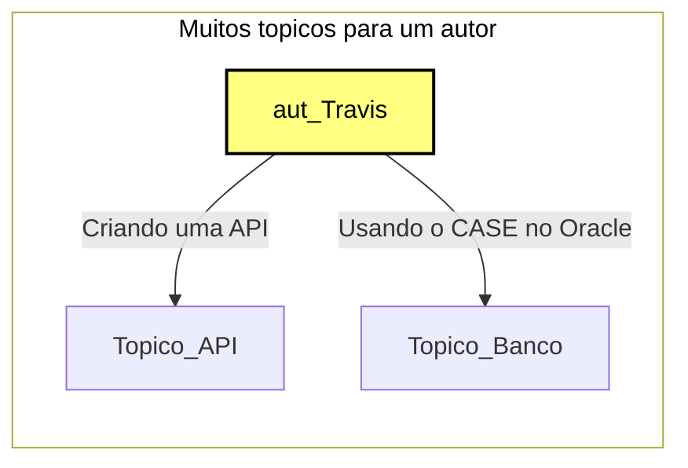
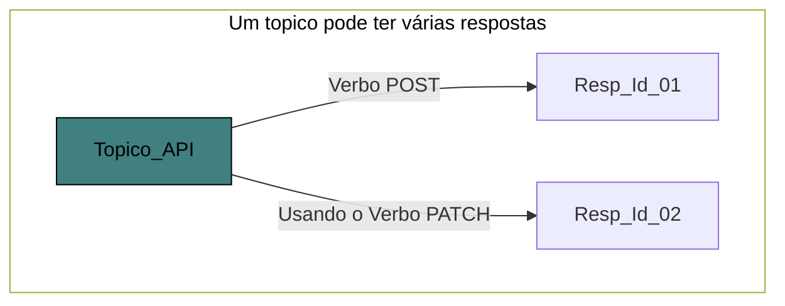

# API de Fórum

## Criação do projeto
- [Criação do projeto pelo site](https://start.spring.io/)
	- Grupo
		- Organização, Exemplo: br.com.projeto
	- Artifact
		- Nome do projeto

## Acesso a aplicação
- [URL](http://localhost:8080/)
- [Console H2](http://localhost:8080/h2-console)

## Notações
- @RequestMapping("/")
	- path do método ou do controller
- @ResponseBody
	- Devolve a string direto para o navegador
	- Se não existir ele vai enteder que será uma página para se redirecionada
- @Enumerated(EnumType.STRING)
	- Grava no banco o valor do Enum
- @RequestBody
    - Pega os dados do corpo da requisição
- @PathVariable
    - Indica que vem um parametro da URL
- @Transactional
    - Comitar a transação no final
- Para receber parâmetros dinâmicos no path da URL, devemos utilizar a anotação @PathVariable;
- Para mapear requisições do tipo PUT, devemos utilizar a anotação @PutMapping;
- Para fazer o controle transacional automático, devemos utilizar a anotação @Transactional nos métodos do controller;
- Para mapear requisições do tipo DELETE, devemos utilizar a anotação @DeleteMapping;
- Para tratar o erro 404 na classe controller, devemos utilizar o método findById, ao invés do método getOne, e utilizar a classe ResponseEntity para montar a resposta de not found;
- O método getOne lança uma exception quando o id passado como parâmetro não existir no banco de dados;
- O método findById retorna um objeto Optional<>, que pode ou não conter um objeto.

## RestController x Controller
- @Controller é usado para marcar classes como Spring MVC Controller.
- @RestController é uma anotação de conveniência que não faz nada mais do que adicionar as anotações @Controller e @ResponseBody 
- Se você estiver familiarizado com os serviços REST, sabe que a diferença fundamental entre um aplicativo web e uma API REST é que a resposta de um aplicativo da web é uma visualização geral de HTML + CSS + JavaScript enquanto a API REST apenas retorna dados em forma de JSON ou XML

## DTO - Objeto de Transferencia de Dados, alguns usam  VO Value Object
- Data transfer object design pattern é um padrão de arquitetura de objetos que agregam e encapsulam dados para transferência.
- Não é uma boa prática devolver em uma listagem uma Entidade, por isso usamos o DTO para devolve os objetos.

## Ligações
> Exemplo Topicos
- ligação Topico -> Autor
- @ManyToOne


- ligação Topico -> Respostas
- @OneToMany(mappedBy = "topico")


## Configurações do Banco H2
```
# data source
spring.datasource.driverClassName=org.h2.Driver
spring.datasource.url=jdbc:h2:mem:alura-forum
spring.datasource.username=sa
spring.datasource.password=

# jpa
spring.jpa.database-platform=org.hibernate.dialect.H2Dialect
spring.jpa.hibernate.ddl-auto=update

# Nova propriedade a partir da versao 2.5 do Spring Boot:
spring.jpa.defer-datasource-initialization=true

# h2
spring.h2.console.enabled=true
spring.h2.console.path=/h2-console
```
## Repository
- O **JpaRepository** utiliza de alguns padrões para busca no banco de dados, como por exemplo:
    - findById: Busca por Id especifico
    - findAll: Trás todos os campos
- Também é possível personalizar as consultas, no caso da entidade tópico que tem uma ligação com o curso, poderia fazer o seguinte:
    - findBy + Entidade + Atributo da entidade
        - *findByCursoNome*
    - Para atributo da entidade tópico
        - *findByTitulo*
    - Caso tenha um atributo em titulo com o nome de **cursoNome**, então em sua consulta personalizada coloque o seguinte:
        - *findByCurso_nome*
- Consultas personalisadas, não utilizando a convenção do Spring
- JPQL significa Java Persistence Query Language. 
- Ele é usado para criar consultas contra entidades para armazenar em um banco de dados relacional.

```
	@Query("SELECT t FROM Topico t WHERE t.curso.nome = :nomeCurso")
	List<Topico> carregarPorNomeDoCurso(@Param("nomeCurso") String nomeCurso);
```

## Retorno de resposta de criação 201
- Semântica do **create**
```
URI uri = uriBuilder.path("/topicos/{id}").buildAndExpand(topico.getId()).toUri();
return ResponseEntity.created(uri).body(new TopicoDTO(topico));
```
- No corpo da resposta você  devolve
    - Código 201.
    - Cabeça location com a url do novo recurso.
    - Uma representação do novo recuros que acabou de ser criado.
- Passado no parâmetro da requisição **UriComponentsBuilder uriBuilder**
    - Ele pega a URI base
- Pega o Id através do *topico.getId()* e coloca no *{id}*
- Depois converte tudo em uma URI

## BeanValidatio
### Dependência
```
<dependency>
    <groupId>org.springframework.boot</groupId>
    <artifactId>spring-boot-starter-validation</artifactId>
</dependency>
```
### Notações
- Para fazer validações das informações enviadas pelos clientes da API, podemos utilizar a especificação Bean Validation, Validações para o DTO
- **@NotEmpty**
    - Campo não pode ser vazio
- **@NotNull **
    - Campo não pode ser Null
- **@Length(min = 5)**
    - amanho mínimo do campo
> Para as validações funcionarem e necessário adicionar a notação **@Valid** nos parâmetros do método do recurso.

- Para interceptar as exceptions que forem lançadas nos métodos das classes controller, devemos criar uma classe anotada com @RestControllerAdvice;

- Para tratar os erros de validação do Bean Validation e personalizar o JSON, que será devolvido ao cliente da API, com as mensagens de erro, devemos criar um método na classe @RestControllerAdvice e anotá-lo com @ExceptionHandler e @ResponseStatus.
```
@Autowired
	private MessageSource messageSource;

	@ResponseStatus(code = HttpStatus.BAD_REQUEST)
	@ExceptionHandler(MethodArgumentNotValidException.class)
	public List<ErroDeFormularioDTO> handle(MethodArgumentNotValidException exception) {
		List<ErroDeFormularioDTO> dto = new ArrayList<>();
		
		List<FieldError> fieldErrors = exception.getBindingResult().getFieldErrors();
		
		fieldErrors.forEach(e -> {
			String mensagem = messageSource.getMessage(e, LocaleContextHolder.getLocale());
			ErroDeFormularioDTO erro = new ErroDeFormularioDTO(e.getField(), mensagem);
			dto.add(erro);
		});
		
		return dto;
	}
```
- Neste exemplo foi criado um DTo para retorno do erro.
- Pega todos os erros dos campos do formulário
    - exception.getBindingResult().getFieldErrors();
- Pega o Idioma do cliente
    - messageSource
- Pega o locale do cliente
    - LocaleContextHolder.getLocale()
- Passa o Locale através da requisição
    - Adicione aos Headers
        - Accept-Language: en-US

### Transactional
- Ao finalizar o método, o Spring efetuará o commit automático da transação, caso nenhuma exception tenha sido lançada.
- Métodos anotados com ```@Transactional``` serão executados dentro de um contexto transacional.

## Optional
- é uma classe que foi implementada no Java 8, que tem o objetivo de simplificar os códigos, facilitando a vida dos desenvolvedores. O Optional nos ajuda a evitar os erros NullPointerException, tirar a necessidade da verificação (if x != null) e também a escrever um código com menos linhas e mais bonito.
- Evita exceção
- 
```
Optional<Topico> topico = topicoRepository.findById(id);

if (topico.isPresent()) {
    return ResponseEntity.ok(new DetalhesDoTopicoDTO(topico.get()));
}

return ResponseEntity.notFound().build();
```

### Paginação
- Para realizar paginação com Spring Data JPA, devemos utilizar a interface Pageable;
- Nas classes Repository, os métodos que recebem um pageable como parâmetro retornam objetos do tipo Page<>, ao invés de List<>;
- Para o Spring incluir informações sobre a paginação no JSON de resposta enviado ao cliente da API, devemos alterar o retorno do método do - controller de List<> para Page<>;
- Para fazer a ordenação na consulta ao banco de dados, devemos utilizar também a interface Pageable, passando como parâmetro a direção da - ordenação, utilizando a classe Direction, e o nome do atributo para ordenar;
- Para receber os parâmetros de ordenação e paginação diretamente nos métodos do controller, devemos habilitar o módulo - SpringDataWebSupport, adicionando a anotação @EnableSpringDataWebSupport na classe ForumApplication.

### Trabalhando com Cache
- Para utilizar o módulo de cache do Spring Boot, devemos adicioná-lo como dependência do projeto no arquivo pom.xml;
- Para habilitar o uso de caches na aplicação, devemos adicionar a anotação @EnableCaching na classe ForumApplication;
- Para que o Spring guarde o retorno de um método no cache, devemos anotá-lo com @Cacheable;
- Para o Spring invalidar algum cache após um determinado método ser chamado, devemos anotá-lo com @CacheEvict;
- Devemos utilizar cache apenas para as informações que nunca ou raramente são atualizadas no banco de dados.

### Spring Security
- Para utilizar o módulo do Spring Security, devemos adicioná-lo como dependência do projeto no arquivo pom.xml;
- Para habilitar e configurar o controle de autenticação e autorização do projeto, devemos criar uma classe e anotá-la com @Configuration e @EnableWebSecurity;
- Para liberar acesso a algum endpoint da nossa API, devemos chamar o método ```http.authorizeRequests().antMatchers().permitAll()``` dentro do método ```configure(HttpSecurity http)```, que está na classe ```SecurityConfigurations```;
- O método anyRequest().authenticated() indica ao Spring Security para bloquear todos os endpoints que não foram liberados anteriormente com o método permitAll();
- Para implementar o controle de autenticação na API, devemos implementar a interface UserDetails na classe Usuario e também implementar a interface GrantedAuthority na classe Perfil;
- Para o Spring Security gerar automaticamente um formulário de login, devemos chamar o método and().formLogin(), dentro do método configure(HttpSecurity http), que está na classe SecurityConfigurations;
- A lógica de autenticação, que consulta o usuário no banco de dados, deve implementar a interface UserDetailsService;
- Devemos indicar ao Spring Security qual o algoritmo de hashing de senha que utilizaremos na API, chamando o método passwordEncoder(), dentro do método configure(AuthenticationManagerBuilder auth), que está na classe SecurityConfigurations.

### JWT
- Em uma API Rest, não é uma boa prática utilizar autenticação com o uso de session;
- Uma das maneiras de fazer autenticação stateless é utilizando tokens JWT (Json Web Token);
- Para utilizar JWT na API, devemos adicionar a dependência da biblioteca jjwt no arquivo pom.xml do projeto;
- Para configurar a autenticação stateless no Spring Security, devemos utilizar o método sessionManagement().sessionCreationPolicy(SessionCreationPolicy.STATELESS);
- Para disparar manualmente o processo de autenticação no Spring Security, devemos utilizar a classe AuthenticationManager;
- Para poder injetar o AuthenticationManager no controller, devemos criar um método anotado com @Bean, na classe SecurityConfigurations, que retorna uma chamada ao método super.authenticationManager();
- Para criar o token JWT, devemos utilizar a classe Jwts;
- O token tem um período de expiração, que pode ser definida no arquivo application.properties;
- Para injetar uma propriedade do arquivo application.properties, devemos utilizar a anotação @Value.

### Autenticação JWT
- Para enviar o token JWT na requisição, é necessário adicionar o cabeçalho Authorization, passando como valor Bearer token;
- Para criar um filtro no Spring, devemos criar uma classe que herda da classe OncePerRequestFilter;
- Para recuperar o token JWT da requisição no filter, devemos chamar o método request.getHeader("Authorization");
- Para habilitar o filtro no Spring Security, devemos chamar o método and().addFilterBefore(new AutenticacaoViaTokenFilter(), UsernamePasswordAuthenticationFilter.class);
- Para indicar ao Spring Security que o cliente está autenticado, devemos utilizar a classe SecurityContextHolder, chamando o método SecurityContextHolder.getContext().setAuthentication(authentication).

### Monitorando a aplicação com o Actuator
- Para adicionar o Spring Boot Actuator no projeto, devemos adicioná-lo como uma dependência no arquivo pom.xml;
- Para acessar as informações disponibilizadas pelo Actuator, devemos entrar no endereço http://localhost:8080/actuator;
- Para liberar acesso ao Actuator no Spring Security, devemos chamar o método .antMatchers(HttpMethod.GET, "/actuator/**");
- Para que o Actuator exponha mais informações sobre a API, devemos adicionar as propriedades management.endpoint.health.show-details=always e management.endpoints.web.exposure.include=* no arquivo application.properties;
- Para utilizar o Spring Boot Admin, devemos criar um projeto Spring Boot e adicionar nele os módulos spring-boot-starter-web e spring-boot-admin-server;
- Para trocar a porta na qual o servidor do Spring Boot Admin rodará, devemos adicionar a propriedade server.port=8081 no arquivo application.properties;
- Para o Spring Boot Admin conseguir monitorar a nossa API, devemos adicionar no projeto da API o módulo spring-boot-admin-client e também adicionar a propriedade spring.boot.admin.client.url=http://localhost:8081 no arquivo application.properties;
- Para acessar a interface gráfica do Spring Boot Admin, devemos entrar no endereço http://localhost:8081.

- [Acessar monitoramento](http://localhost:8081/#/applications/spring-boot-application)

### Documentação com Swagger
- Para documentar a nossa API Rest, podemos utilizar o Swagger, com o módulo SpringFox Swagger;
- Para utilizar o SpringFox Swagger na API, devemos adicionar suas dependências no arquivo pom.xml;
- Para habilitar o Swagger na API, devemos adicionar a anotação @EnableSwagger2 na classe ForumApplication;
As configurações do Swagger devem ser feitas criando-se uma classe chamada SwaggerConfigurations e adicionando nela a anotação @Configuration;
- Para configurar quais endpoints e pacotes da API o Swagger deve gerar a documentação, devemos criar um método anotado com @Bean, que devolve um objeto do tipo Docket;
- Para acessar a documentação da API, devemos entrar no endereço http://localhost:8080/swagger-ui.html;
- Para liberar acesso ao Swagger no Spring Security, devemos chamar o seguinte método ```web.ignoring().antMatchers("/**.html", "/v2/api-docs", "/webjars/**", "/configuration/**", "/swagger-resources/**")```, dentro do método void configure(WebSecurity web), que está na classe SecurityConfigurations.

- [Acessar Documentação](http://localhost:8080/swagger-ui.html)

### Trabalhando com roles
- Para atualizar a versão do Spring Boot na aplicação, basta alterar a tag <version> da tag <parent>, no arquivo pom.xml.
- É importante ler as release notes das novas versões do Spring Boot, para identificar possíveis quebras de compatibilidades ao atualizar a aplicação.
- É possível restringir o acesso a determinados endpoints da aplicação, de acordo com o perfil do usuário autenticado, utilizando o método hasRole(“NOME_DO_ROLE”) nas configurações de segurança da aplicação.

### Profiles anotation
- Profiles devem ser utilizados para separar as configurações de cada tipo de ambiente, tais como desenvolvimento, testes e produção.
- A anotação @Profile serve para indicar ao Spring que determinada classe deve ser carregada apenas quando determinados profiles estiverem ativos.
- É possível alterar o profile ativo da aplicação por meio do parâmetro -Dspring.profiles.active.
- Ao não definir um profile para a aplicação, o Spring considera que o profile ativo dela e o profile de nome default.

### Testes unitários
- É possível escrever testes automatizados de classes que são beans do Spring, como Controllers e Repositories.
- É possível utilizar injeção de dependências nas classes de testes automatizados.
- A anotação @SpringBootTest deve ser utilizada nas classes de testes automatizados para que o Spring inicialize o servidor e disponibilize os beans da aplicação.
- Ao testar uma interface Repository devemos, preferencialmente, utilizar a anotação @DataJpaTest.
- Por padrão, os testes automatizados dos repositories utilizam um banco de dados em memória, como o h2.
- É possível utilizar outro banco de dados para os testes automatizados, utilizando a anotação @AutoConfigureTestDatabase(replace = AutoConfigureTestDatabase.Replace.NONE).
- É possível forçar um profile específico para os testes automatizados com a utilização da anotação @ActiveProfiles.
- Para conseguir injetar o MockMvc devemos anotar a classe de teste com @AutoConfigureMockMvc.


### Gerando jar e war
- O build da aplicação é realizado via maven, com o comando mvn clean package.
- Ao realizar o build, por padrão será criado um arquivo .jar.
- É possível passar parâmetros para as configurações da aplicação via variáveis de ambiente.
- É possível alterar o build para criar um arquivo .war, para deploy em servidores de aplicações.

- Se tiver o maven instalado, vá na raiz do projeto e dê
```
mvn clean package
```
- Pra rodar a aplicação, entre na pasta target e rode o comando abaixo

```
java -jar forum-0.0.1-SNAPSHOT.ja
```
- Pra rodar a aplicação definindo o ambiente

```
java -jar -Dspring.profiles.active=prod forum.jar
```

### Configurando Docker
- É possível utilizar o Docker para criação de imagens e de containers para aplicações que utilizam Java com Spring Boot.
- Devemos criar um arquivo Dockerfile no diretório raiz da aplicação, para ensinar ao Docker como deve ser gerada a imagem dela.
- É possível passar as variáveis de ambiente utilizadas pela aplicação para o container Docker.
- É possível realizar o deploy de aplicações Java com Spring Boot em ambientes Cloud, como o Heroku.
- Cada provedor Cloud pode exigir diferentes configurações adicionais a serem realizadas na aplicação, para que ela seja executada sem nenhum tipo de problema.

```
docker build -t alura/forum .

docker images

docker run -p 8080:8080 -e SPRING_PROFILES_ACTIVE='prod' -e FORUM_DATABASE_URL='jdbc:h2:mem:alura-forum' -e FORUM_DATABASE_USERNAME='sa' -e FORUM_DATABASE_PASSWORD='' -e FORUM_JWT_SECRET='123456' alura/forum
```

#### Deploy no Heroku
1 - heroku login
2- heroku container:login
3- heroku create app-alura-forum
4- heroku git:remote -a app-alura-forum
6- Adicionar dados de porta e quantidade de memória
```
ENTRYPOINT ["java","Xmx512m","-jar","-Dserver.port=${PORT}","/app.jar"]
```
7- Adicionar configuração no properties
    - application-prod.properties
```
server.port=${PORT}
```
8- Criar variáveis de ambiente na heroku
    - Entre no painel da aplicação
    - settings
    - Reveal Config Vars
        - nome e valor das chaves
```
PORT                    : 8080
SPRING_PROFILES_ACTIVE  : prod
FORUM_DATABASE_URL      : jdbc:h2:mem:alura-forum
FORUM_DATABASE_USERNAME : sa
FORUM_DATABASE_PASSWORD :
FORUM_JWT_SECRET        : safmsfuirofrsmfr
```
9- heroku container:push web 
10- heroku container:release web 
11- heroku open
12- heroku logs --tail

### Informações gerais


> 3.4.2
- 1: *Major* Mudança drástica                : Crítica
- 2: *Minor* Novas funcionalidades           : Podem haver mudanças críticas
- 3: *Patch* Correções de bugs e segurança   : Baixa probabilidade de mudanças críticas


### Referências
- [Api para o actuator](https://codecentric.github.io/spring-boot-admin/current/)
- [Swagger](https://swagger.io/)
- [Spring Fox](https://springfox.github.io/springfox/)
- [Container Registry & Runtime (Docker Deploys)](https://devcenter.heroku.com/articles/container-registry-and-runtime)